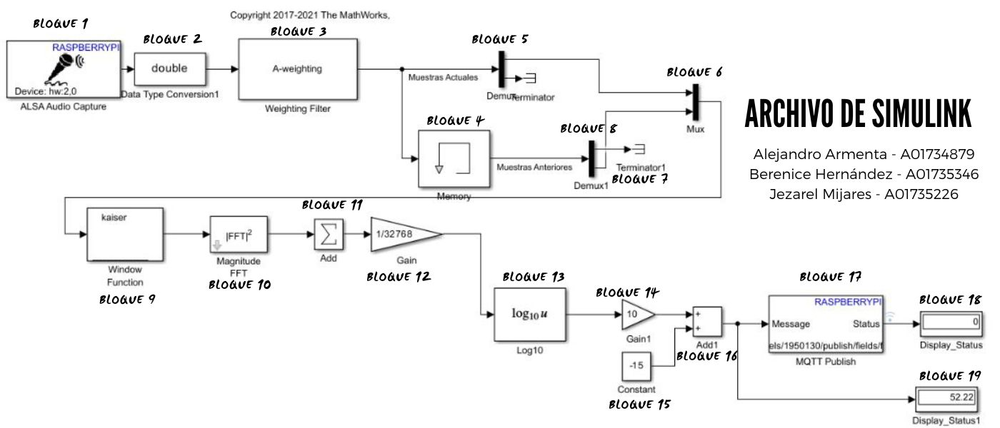

# 🌆 DISCRIMINACIÓN DE AGENTES EMISORES DE RUIDO URBANO EMPLEANDO REDES DE SENSORES Y TÉCNICAS MULTIAGENT

Bienvenido al repositorio del **Proyecto Final de Sistemas Embebidos Avanzados**. Este proyecto se centra en la discriminación de agentes emisores de ruido urbano mediante el uso de redes de sensores y técnicas multiagente, proporcionando una solución innovadora para el monitoreo y gestión del ruido en entornos urbanos.

## Descripción del Proyecto

Este proyecto consta de dos componentes principales:
1. **Simulación en Simulink**: Un diagrama detallado que ilustra la lógica y flujo de trabajo del sistema.
2. **Sistema de Comunicación MQTT en Raspberry Pi**: Un sistema de comunicación robusto y eficiente basado en MQTT, que permite la interacción y control remoto del sistema de monitoreo de ruido.

## Imagen del Proyecto y Diagramas

## Archivos del Proyecto

- `Simulink_Reto.jpg`: Imagen del diagrama en Simulink.
- `proyecto_final.zip`: Archivo comprimido con el código y los archivos necesarios para el proyecto.
- `raspberrypi_MQTT_final.slx`: Archivo de Simulink para la simulación.

## Requisitos

- MATLAB con Simulink.
- Raspberry Pi con sistema operativo Raspbian.
- Conexión a internet para la comunicación MQTT.
